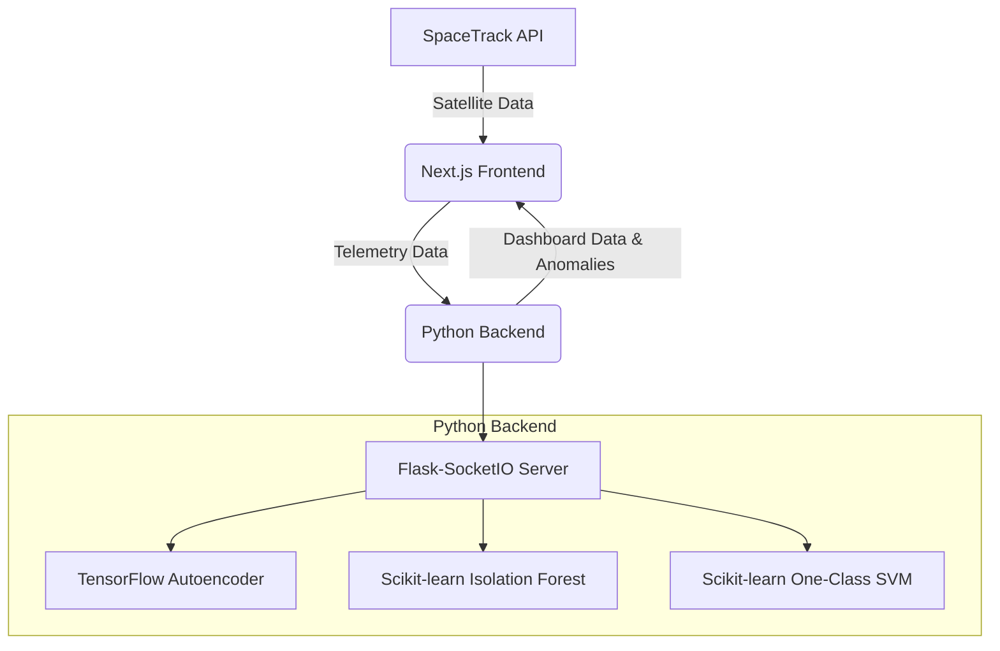

# Orbitwatch: Real-Time Satellite Anomaly Detection

Orbitwatch is a web-based application for real-time monitoring of satellite telemetry data and detection of anomalies using machine learning.

## Features

- **Real-Time Dashboard:** A comprehensive dashboard that visualizes satellite data, including an orbital map, alerts, and various telemetry metrics.
- **Machine Learning-Powered Anomaly Detection:** Utilizes a combination of TensorFlow and scikit-learn models to detect anomalies in satellite telemetry data.
- **Manual Alerting:** Allows users to manually create and flag anomalies.
- **Real-Time Updates:** The UI updates in real-time as new data is received and processed.
- **Orbital Map:** A Leaflet-based map that displays the real-time location of satellites and anomalies.

## How it Works

Orbitwatch consists of a Next.js frontend and a Python backend. The frontend and backend communicate via WebSockets, allowing for real-time data exchange.

### Frontend

The frontend is a Next.js application that visualizes the data received from the backend. It uses a `RealTimeInferenceService` to manage the WebSocket connection and handle data flow. The UI is built with React and various libraries for charting and mapping.

### Backend

The backend is a Flask-SocketIO server that handles the machine learning and data processing. It receives telemetry data from the frontend, uses a suite of ML models to detect anomalies, and broadcasts the results back to the frontend.

### Architecture



### Machine Learning Models

Orbitwatch uses a combination of three machine learning models to detect anomalies:

- **TensorFlow Autoencoder:** An unsupervised neural network that learns to reconstruct normal telemetry data. A high reconstruction error indicates an anomaly.
- **Scikit-learn Isolation Forest:** An ensemble-based model that isolates anomalies by randomly partitioning the data.
- **Scikit-learn One-Class SVM:** A Support Vector Machine model that learns a decision boundary around normal data points.

#### Inputs

The models are trained on the following telemetry data:

- `temperature`: The satellite's internal temperature.
- `power`: The satellite's power level.
- `communication`: The satellite's communication signal strength.
- `orbit`: The satellite's altitude.
- `voltage`: The satellite's voltage.
- `solarPanelEfficiency`: The efficiency of the satellite's solar panels.
- `attitudeControl`: The satellite's attitude control status.
- `fuelLevel`: The satellite's fuel level.

#### Outputs

The backend emits a `new_anomaly` event with the following information:

- `id`: A unique identifier for the anomaly.
- `satelliteName`: The name of the satellite.
- `anomalyResult`: An object containing the anomaly type and severity.
- `timestamp`: The timestamp of the anomaly.
- `location`: The latitude, longitude, and altitude of the satellite at the time of the anomaly.

#### Training

The models are trained on an initial batch of data when the first client connects. Subsequently, the models are retrained every hour in a background thread, provided that at least 100 new data points have been collected.

## Setup Instructions

To run Orbitwatch locally, you will need to have Node.js and Python installed.

1.  **Clone the repository:**
    ```bash
    git clone <repository-url>
    cd <repository-directory>
    ```
2.  **Install frontend dependencies:**
    ```bash
    npm install
    ```
3.  **Install backend dependencies:**
    ```bash
    pip install -r requirements.txt
    ```
4.  **Set up SpaceTrack credentials:**
    You will need to create a file named `.env.local` in the root of the project and add your SpaceTrack credentials as follows:
    ```
    SPACETRACK_USER=<your-username>
    SPACETRACK_PASSWORD=<your-password>
    ```
5.  **Start the backend server:**
    ```bash
    python3 services/ml_service/main.py
    ```
6.  **Start the frontend server:**
    ```bash
    npm run dev
    ```
7.  **Open the application in your browser:**
    Navigate to `http://localhost:3000` to view the Orbitwatch dashboard.
