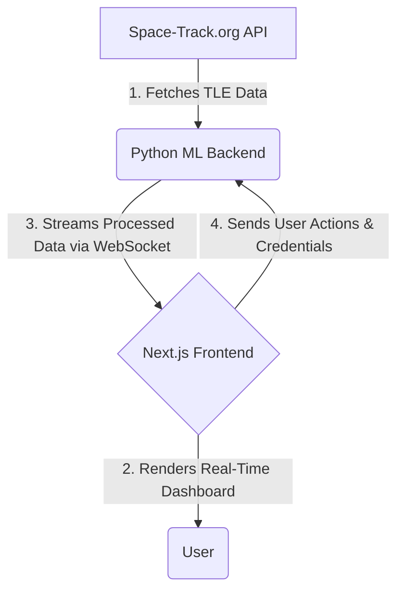

# Orbitwatch: Real-Time Satellite Anomaly Detection

**Orbitwatch** is a comprehensive, real-time satellite anomaly detection platform. It provides a high-fidelity dashboard for monitoring satellite health, visualizing orbital data, and detecting potential anomalies using a powerful Python-based machine learning backend.


---

## Table of Contents

- [Features](#features)
- [Architecture](#architecture)
- [The Machine Learning Pipeline](#the-machine-learning-pipeline)
- [SGP4 Integration](#sgp4-integration)
- [Dashboard Components Explained](#dashboard-components-explained)
- [Getting Started](#getting-started)
  - [Prerequisites](#prerequisites)
  - [Installation](#installation)
  - [Running the Application](#running-the-application)
- [Technology Stack](#technology-stack)

---

## Features

Orbitwatch is designed to provide a complete, end-to-end solution for satellite monitoring and anomaly detection.

-   **Real-Time Dashboard:** A dynamic and intuitive user interface that updates in real-time without the need for page reloads. All components, from key performance indicators to charts, are streamed live from the backend.
-   **Interactive Orbital Map:** A lightweight and performant orbital map, built with Leaflet.js, that visualizes satellite positions and highlights anomalies as they are detected.
-   **In-App Spacetrack Configuration:** Securely configure your SpaceTrack.org credentials directly within the application. Once saved, Orbitwatch will immediately begin ingesting and displaying real-time satellite data.
-   **Hybrid Anomaly Detection:** A sophisticated backend powered by a combination of TensorFlow and Scikit-learn models to provide robust and sensitive anomaly detection.
-   **Rich Data Visualization:** The dashboard includes a variety of components to provide a deep understanding of the satellite network's health, including:
    -   **RSO Characterization:** Panels that provide detailed information on Resident Space Objects.
    -   **Logging:** A real-time log of all detected anomalies and system events.
    -   **Manual Alerts:** The ability for users to manually flag anomalies and create their own alerts.
-   **SPARTA/MITRE TTP Alignment:** A unique feature that maps detected anomalies to the [SPARTA](https://sirt.arizona.edu/projects/sparta) framework, providing valuable context for threat intelligence.

---

## Architecture

Orbitwatch is built on a modern, three-tier architecture that is designed for real-time data flow and scalability.



1.  **Data Source (Space-Track.org API):** The application uses the official Space-Track.org API as its source of live satellite Two-Line Element (TLE) data.
2.  **Python ML Backend (The Brain):** The core of the application is a Python service built with Flask-SocketIO. It is responsible for:
    -   **Data Ingestion:** Periodically fetching and parsing live TLE data from Space-Track.
    -   **ML Pipeline:** Managing the training and real-time inference of a hybrid set of machine learning models.
    -   **Real-Time Analysis:** Detecting anomalies and generating rich data payloads, including logs and SPARTA/MITRE TTP alignments.
    -   **Data Streaming:** Broadcasting the complete, processed dashboard data to all connected clients via WebSockets.
3.  **Next.js Frontend (The User Experience):** The user-facing application is a modern web application built with Next.js and React. It establishes a persistent WebSocket connection with the backend to receive a continuous stream of data, which it then uses to render the interactive dashboard and orbital map.

This decoupled architecture ensures a clean separation of concerns, making the system scalable and maintainable.

---

## The Machine Learning Pipeline

The heart of the Orbitwatch backend is its sophisticated machine learning pipeline, which is designed for robust and sensitive anomaly detection.

-   **Inputs:** The models are trained on a feature set extracted from the TLE data, which includes:
    -   `temperature`: The satellite's internal temperature.
    -   `power`: The satellite's power level.
    -   `communication`: The strength of the satellite's communication signal.
    -   `orbit`: The satellite's altitude.
    -   `voltage`: The satellite's voltage.
    -   `solarPanelEfficiency`: The efficiency of the satellite's solar panels.
    -   `attitudeControl`: A measure of the satellite's orientation control.
    -   `fuelLevel`: The satellite's remaining fuel level.
-   **Outputs:** The models produce the following outputs:
    -   `reconstruction_error`: The reconstruction error from the TensorFlow Autoencoder.
    -   `if_score`: The anomaly score from the Isolation Forest model.
    -   `svm_score`: The anomaly score from the One-Class SVM model.
-   **Hybrid Model Approach:** Orbitwatch uses a combination of models to ensure the highest level of accuracy:
    -   **TensorFlow Autoencoder:** This neural network learns a baseline of normal operational patterns and is excellent at detecting subtle deviations from that baseline. It works by compressing the input data and then reconstructing it; a high reconstruction error indicates an anomaly.
    -   **Scikit-learn Isolation Forest:** An ensemble model that excels at identifying statistical outliers in the data. It works by randomly partitioning the data, and anomalies are the points that are easiest to "isolate" from the rest of the data.
    -   **Scikit-learn One-Class SVM:** A classic and powerful algorithm for novelty and outlier detection. It is trained on "normal" data and learns a boundary around it. Any new data point that falls outside this boundary is considered an anomaly.
-   **Training:** The models are trained on an initial batch of live data that is fetched when the backend server starts and the user provides their SpaceTrack credentials. The system is designed for periodic retraining, allowing it to adapt to new patterns over time.

By combining the results from these three models, Orbitwatch is able to detect a wide range of potential anomalies with a high degree of confidence.

---

## SGP4 Integration

The Simplified General Perturbations 4 (SGP4) is a standard model used to predict the location of satellites. Orbitwatch uses the SGP4 model to propagate the satellite orbits from the TLE data, providing accurate and real-time satellite positions on the interactive map. This allows for a more realistic and accurate visualization of the satellite's trajectory and current location.

---

## Dashboard Components Explained

-   **Overall Threat Score:** An aggregated score that provides a high-level overview of the threat level of a Resident Space Object (RSO). This score is calculated as the average of the individual anomaly scores from the machine learning models.
-   **Threat Score Breakdown:** A detailed breakdown of the threat score, showing the individual anomaly scores from each of the machine learning models:
    -   **Autoencoder:** The anomaly score from the TensorFlow Autoencoder model.
    -   **Isolation Forest:** The anomaly score from the Scikit-learn Isolation Forest model.
    -   **SVM:** The anomaly score from the Scikit-learn One-Class SVM model.
-   **Orbital Parameters:** Key data points that describe the satellite's orbit, including:
    -   **Inclination:** The angle of the orbit in relation to the Earth's equator.
    -   **RAAN (Right Ascension of the Ascending Node):** The angle from the vernal equinox to the point where the orbit crosses the equatorial plane from south to north.
    -   **Argument of Perigee:** The angle from the ascending node to the perigee (the point in the orbit closest to Earth).
-   **TTPs (Tactics, Techniques, and Procedures):** The dashboard maps detected anomalies to the SPARTA/MITRE framework to provide context for threat intelligence. This helps to understand the potential intent behind an anomaly.
-   **RSOs (Resident Space Objects):** The dashboard provides detailed characterization of RSOs, including their country of origin, launch date, and orbital period.
-   **Alerts:** Real-time alerts are generated whenever an anomaly is detected by the machine learning pipeline. Users can also manually create alerts.

---

## Getting Started

Follow these instructions to set up and run the Orbitwatch application on your local machine.

### Prerequisites

-   [Node.js](https://nodejs.org/) (v18 or later)
-   [Python](https://www.python.org/) (v3.9 or later)
-   A [Space-Track.org](https://www.space-track.org/) account with a verified username and password.

### Installation

1.  **Clone the Repository:**
    ```bash
    git clone https://github.com/your-username/orbitwatch.git
    cd orbitwatch
    ```

2.  **Install Frontend Dependencies:**
    ```bash
    npm install
    ```

3.  **Install Backend Dependencies:**
    ```bash
    pip install -r requirements.txt
    ```

### Running the Application

You will need to run the backend and frontend servers in separate terminals.

1.  **Start the Python ML Backend:**
    ```bash
    python3 services/ml_service/main.py
    ```
    The backend server will start on `http://localhost:5000`.

2.  **Start the Next.js Frontend:**
    ```bash
    npm run dev
    ```
    The frontend development server will start on `http://localhost:3000`.

3.  **Configure Space-Track Credentials:**
    -   Open your browser and navigate to `http://localhost:3000`.
    -   Click on the **Settings** icon in the header.
    -   Enter your Space-Track.org username and password, and click **Save**.
    -   The application will now start fetching and displaying real-time satellite data.

---

## Technology Stack

### Backend

-   **Python**
-   **Flask-SocketIO:** For real-time, bi-directional communication with the frontend.
-   **TensorFlow/Keras:** For the autoencoder model.
-   **Scikit-learn:** For the Isolation Forest and One-Class SVM models.
-   **Requests:** For fetching data from the Space-Track.org API.

### Frontend

-   **Next.js:** A React framework for building modern web applications.
-   **React:** A JavaScript library for building user interfaces.
-   **Leaflet.js:** An open-source JavaScript library for mobile-friendly interactive maps.
-   **Socket.IO Client:** For connecting to the backend WebSocket server.
-   **Recharts:** A composable charting library built on React components.
-   **Tailwind CSS:** A utility-first CSS framework for rapid UI development.
-   **ShadCN/UI:** A collection of accessible and reusable UI components.
