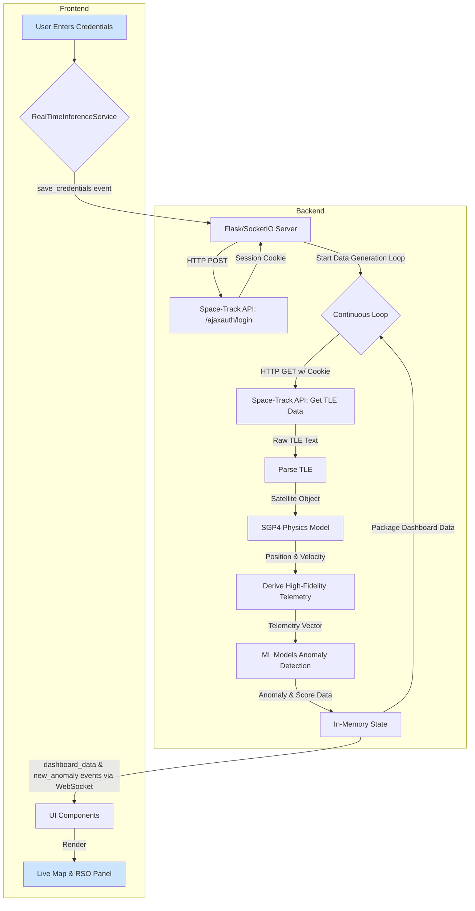

# Orbitwatch - Satellite Anomaly Detection Dashboard

Orbitwatch is a real-time dashboard for monitoring satellite telemetry and detecting anomalies using a combination of machine learning models. It provides a comprehensive view of satellite operations, enabling operators to identify and respond to potential threats with high-fidelity, physics-backed data.

## Table of Contents
1.  [System Architecture](#system-architecture)
2.  [Dashboard UI Explained](#dashboard-ui-explained)
3.  [End-to-End Data Pipeline](#end-to-end-data-pipeline)
4.  [Data Flow Diagram](#data-flow-diagram)
5.  [Space-Track API Integration](#space-track-api-integration)
6.  [Data Architecture: Real-Time, In-Memory Processing](#data-architecture-real-time-in-memory-processing)
7.  [Machine Learning Models](#machine-learning-models)
8.  [Backend (Python / Flask)](#backend-python--flask)
9.  [Frontend (Next.js)](#frontend-nextjs)
10. [Setup and Installation](#setup-and-installation)
11. [Known Issues](#known-issues)

---

## System Architecture

The Orbitwatch application consists of two main components:

1.  **Python Backend:** A Flask application using Socket.IO for real-time communication. It is the authoritative source of all data, responsible for fetching, processing, and analyzing satellite data.
2.  **Next.js Frontend:** A modern, reactive web interface for visualizing the data provided by the backend.

## Dashboard UI Explained

The main dashboard provides a high-level overview of the monitored environment. Here is a breakdown of each metric in the header:

-   **Alerts:** This is a live count of the total number of anomalies that have been detected by the ML models during the current session.
-   **RSOs:** This shows the number of Resident Space Objects (satellites) currently being tracked and analyzed by the system.
-   **TTPs:** This metric represents Tactics, Techniques, and Procedures. It is currently a static placeholder value included for future expansion.
-   **Score:** This is an overall situational awareness score, calculated based on the severity of recent anomalies.

## End-to-End Data Pipeline

The entire system is driven by a real-time, in-memory data pipeline that originates in the Python backend.

1.  **Authentication:** The process begins when the user provides Space-Track.org credentials through the frontend UI.
2.  **TLE Data Fetching:** The backend uses these credentials to authenticate with the Space-Track API and fetches the latest Two-Line Element (TLE) data.
3.  **Orbital Propagation:** The raw TLE data for each satellite is fed into the **SGP4 physics model** to accurately calculate its precise position and velocity.
4.  **Telemetry Derivation:** Using the positional data from SGP4, the backend derives a realistic telemetry vector (power, temperature, etc.) for each satellite.
5.  **ML Anomaly Detection:** This derived telemetry vector is passed to the ML models for anomaly detection.
6.  **Data Streaming:** The results are packaged and streamed to the frontend via a WebSocket.

## Data Flow Diagram

This diagram illustrates the real-time, in-memory data pipeline of the Orbitwatch application.

### Data Accuracy Clarification

-   **The orbital data is real.** It is based on official TLE sets from Space-Track and processed with the industry-standard SGP4 physics model.
-   **The telemetry data is derived.** Since we cannot access the satellite's internal hardware, we generate a high-fidelity, physics-informed estimate of these values. This is a necessary step to create the patterns that the ML models are trained on.

## Space-Track API Integration

This section provides a detailed breakdown of the external API integration.

### Authentication and Security

1.  **Credential Input:** Credentials are entered on the client-side but are **never stored on the client**.
2.  **Authentication Request:** They are immediately sent to the backend, which makes a `POST` request to the Space-Track authentication endpoint (`/ajaxauth/login`).
3.  **Session-Based Security:** Upon successful login, the Space-Track API returns a session cookie. The backend `requests.Session()` object automatically stores and uses this cookie for all subsequent requests.

### API Request for TLE Data
-   **Request Type:** `GET`
-   **Endpoint:** `/basicspacedata/query/class/tle_latest/ORDINAL/1/NORAD_CAT_ID/{NORAD_IDS}/format/tle`
-   **Inputs / Parameters:** `{NORAD_IDS}`: A comma-separated string of NORAD Catalog IDs.

### Returned Data Structure (Output)
-   **Data Format:** The API returns the TLE data as **plain text**.
-   **Structure:** The data follows the rigid, column-based TLE format defined by NORAD.
-   **Consumption:** This raw text is the direct input for the `sgp4` library in the backend.

## Data Architecture: Real-Time, In-Memory Processing

### Rationale for an In-Memory Approach
Orbitwatch is designed for **real-time monitoring**. The primary requirement is to process and visualize the current state of satellite operations with the lowest possible latency. For this reason, a deliberate choice was made to **not use a persistent database**.

### Implications and Data Lifecycle
-   **Transient Data:** All data is **transient**. When the backend server is stopped, all information is cleared. The application is a live monitoring tool, not a historical archive.
-   **Data Lifecycle:**
    1.  **Fetch:** TLE data is fetched from the Space-Track API.
    2.  **Hold & Process:** The data is held in Python data structures in memory just long enough to be processed.
    3.  **Stream:** The processed data is immediately streamed to the frontend via WebSocket.
    4.  **Discard:** As the data loop repeats, the previous state is replaced with the new, live state.

## Machine Learning Models

### Model Explanations & Score Calculation
The high scores (close to 100) seen during normal operation are a positive sign that the models are confident that the satellite is behaving as expected based on the high-fidelity, physics-based data.

Here is a detailed breakdown of how each model's 0-100 score is calculated:

#### 1. TensorFlow Autoencoder
-   **Score Calculation:** The model's reconstruction error (MSE) is normalized and inverted: `score = 100 * (1 - min(reconstruction_error / 0.1, 1))`. A lower error results in a higher score.

#### 2. Scikit-learn Isolation Forest & One-Class SVM
-   **Score Calculation:** Both models use their `decision_function` to produce a raw score. A positive score is normal (returns 100), and a negative score is an anomaly (returns 0).

### Composite Threat Score
The individual scores are averaged to produce a single, holistic **Threat Score**.

## Backend (Python / Flask)
-   **Core Logic:** `services/ml_service/main.py`.
-   **Responsibilities:** Manages the Space-Track API session, runs the data generation loop, performs SGP4 calculations, executes ML models, and streams data to the frontend.
-   **Dependencies:** `requirements.txt`.

## Frontend (Next.js)
-   **Core Logic:**
    - `app/page.tsx`: Main dashboard component.
    - `lib/real-time-inference.ts`: Manages WebSocket connection and state.
    - `app/components/OrbitalMap.tsx`: Renders satellite positions with Leaflet.js.
    - `app/components/RSOCharacterization.tsx`: Displays detailed telemetry and anomaly scores.

## Setup and Installation

### Prerequisites
- Python 3.10+
- Node.js 18+ and npm
- A valid Space-Track.org account

### Backend Setup
1.  Install Python dependencies: `pip install -r requirements.txt`
2.  Start the server: `python3 services/ml_service/main.py`

### Frontend Setup
1.  Install Node.js dependencies: `npm install`
2.  Start the server: `npm run dev`

## Known Issues
-   **Frontend Rendering Crash:** The application is currently affected by a persistent Next.js server-side rendering (SSR) issue that causes the page to load blank with a `500 Internal Server Error`. This is a framework-level issue that requires further, specialized debugging.
